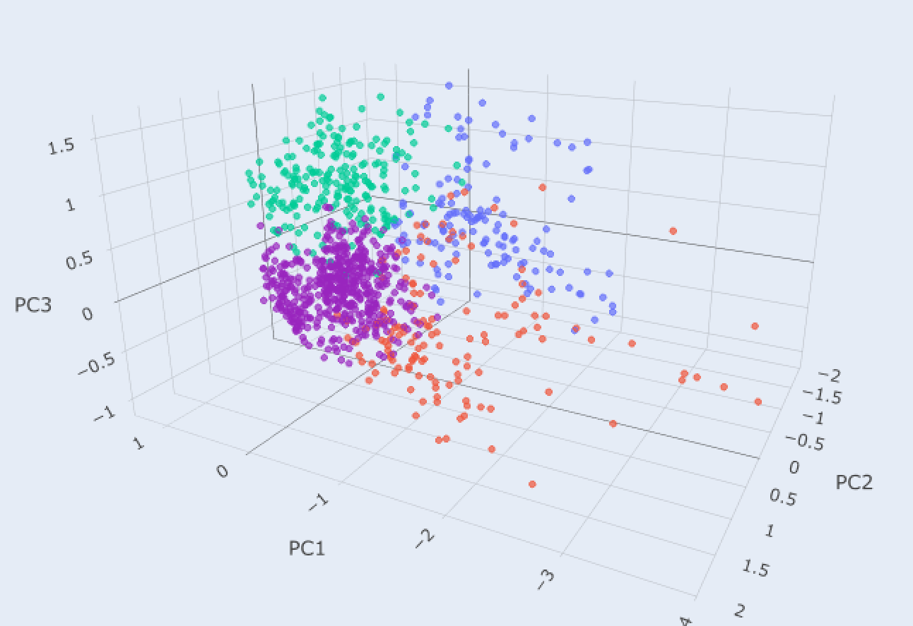
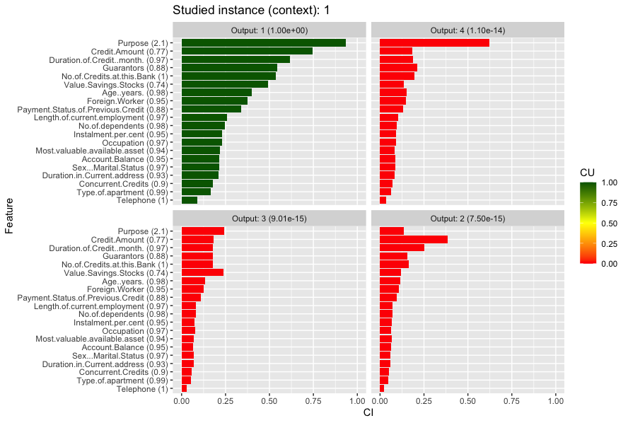

# CIU-Unsupervised-Testing

Using an unsupervised clustering method then attempting to define and assign labels to each cluster based on their most prominent features. 

Example using four clusters on the german credit dataset. This is the resulting distribution of clusters. 

Thereafter extracting the CIU values for the first cluster: 

Likewise a result for cluster number two:

